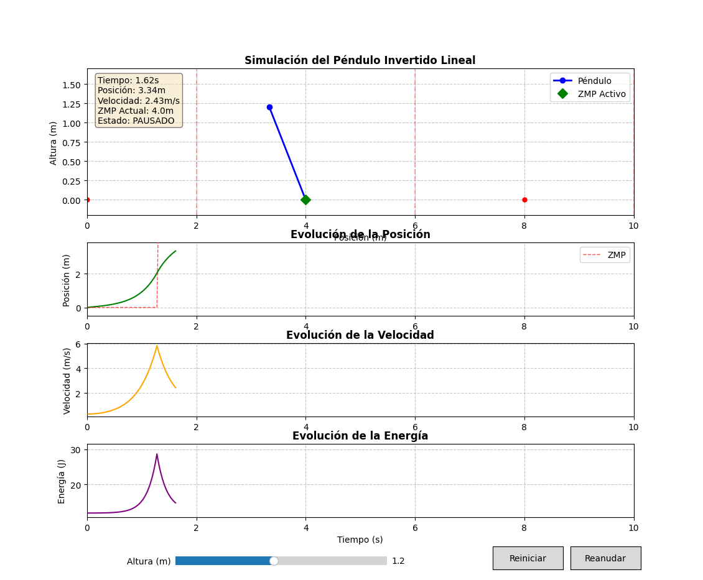
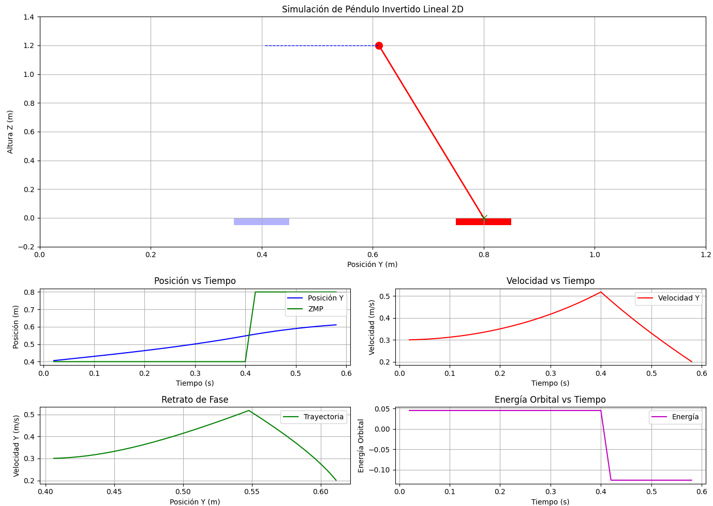

# EntregaHumanoides
## Tabla de Contenidos
1. [Introducción](#Introduccion)
2. [Plano Sagital: lipm2d_sagital.py](#S)
5. [Mejoras: Sagital_Mejorado.py](#MS)
3. [Plano Frontal: lipm2d_frontal.py](#F)
4. [Mejoras: Frontal_Mejorado.py](#MF)
6. [Robot Bipedo: BOBY ](#BOB)
7. [Conclusión](#i4)

## Introducción 
Tal y como se meciona en el guión con esta practica se pretende estudiar la locomocion bipeda. Dado que mi apellido es "rayado" y contiene 6 letras, la variable HEIGHT sera igual a 1.2m en toda la práctica.  

## Plano Sagital 
No se ha requerido ninguna modificación.

## Plano Sagital Mejorado 

### Características Principales
Se ha mejorado significativamente el código original añadiendo mayor estructura, visualización avanzada, controles interactivos y análisis adicional.
### Mejoras:
#### Estructura del Código
- Organización orientada a objetos: Separación clara entre modelo físico, simulación y visualización
- Documentación completa: Docstrings explicativos y comentarios detallados
- Mejor manejo de estados: Control del ciclo de vida de la simulación
#### Visualizacion 
- Panel informativo en tiempo real: Muestra datos de posición, velocidad y estado
- Visualización de ZMP: Puntos y transiciones claramente marcados
- Gráfico de energía: Nuevo gráfico que muestra la evolución energética del sistema
- Mejor estética: Leyendas y cuadrículas mejoradas
### Funcionalidad
- Botones para pausar/reanudar/parar
- Calculo de energía 

## Plano Frontal 
Se ha realizado la modificacion de los siguientes parámetros:
<pre> self.zmp_y = [0.4, 0.8, 0.4, 0.8, 0.4, 0.8, 0.4] </code></pre>
<pre> self.zmp_time_change = [0.4, 1, 1.8, 8, 10.0] </code></pre>

Con estas modificaciones se consigue que sea capaz de hacer ida-vuelta-ida

## Plano Frontal Mejorado 

### Mejoras realizadas:
<ol class="marker:text-textOff list-decimal">
<li>

<strong>Vista principal mejorada</strong>: Visualización completa del péndulo con línea de conexión y masa, representación de los puntos ZMP (Zero Moment Point), trazado de la trayectoria del Centro de Masa (CoM) y visualización de los pies (izquierdo/derecho) usando rectángulos de colores diferenciados.

</li>
<li>

<strong>Panel de información en tiempo real</strong>: Muestra el tiempo actual, posición, velocidad, aceleración, ZMP actual, pie activo y energía orbital.

</li>
<li>

<strong>Múltiples gráficas de análisis</strong>: Incluye gráfica de posición vs. tiempo (del CoM y del ZMP), gráfica de velocidad vs. tiempo, retrato de fase (relación entre posición y velocidad) y evolución de la energía orbital a lo largo del tiempo.

</li>
<li>

<strong>Cálculos dinámicos</strong>: Se calcula la posición usando las ecuaciones del LIPM: y = y₀·cosh(t/Tc) + Tc·ẏ₀·sinh(t/Tc), la velocidad: ẏ = (y₀·sinh(t/Tc)/Tc) + ẏ₀·cosh(t/Tc), y la aceleración: ÿ = (y₀/(Tc²))·cosh(t/Tc) + (ẏ₀/Tc)·sinh(t/Tc).

</li>
<li>

<strong>Energía orbital</strong>: Calculada como E = (1/2)·ẏ² - (g/2h)·y², se representa su evolución temporal y se conserva durante cada fase de apoyo.

</li>
<li>

<strong>Transiciones de apoyo</strong>: Se calcula el punto de cambio de ZMP, se conserva la velocidad durante la transición y se ajusta la posición relativa al nuevo punto de apoyo.

</li>
</ol>

## Robot Bipedo: BOBY 

Ambos algoritmos logran alcanzar la meta, pero presentan ciertas limitaciones:
### 
A*: Al depender de la odometría, tiende a acumular errores a lo largo del recorrido, a pesar de los esfuerzos por minimizar este efecto. ¿Funcionaría mejor con GPS? En teoría, sí, pero solo en esta simulación, donde el GPS no introduce error (aunque en Webots se puede añadir). En un entorno real, los GPS suelen tener un margen de error superior a un metro, lo que los haría poco útiles para este propósito.
### 
Algoritmo de seguimiento de paredes: Su lógica es más sencilla y se puede mejorar fácilmente para reducir colisiones innecesarias contra las paredes. Sin embargo, este tipo de enfoques presentan el riesgo de quedar atrapados en bucles, girando alrededor de "islas" dentro del laberinto sin encontrar la solución.
