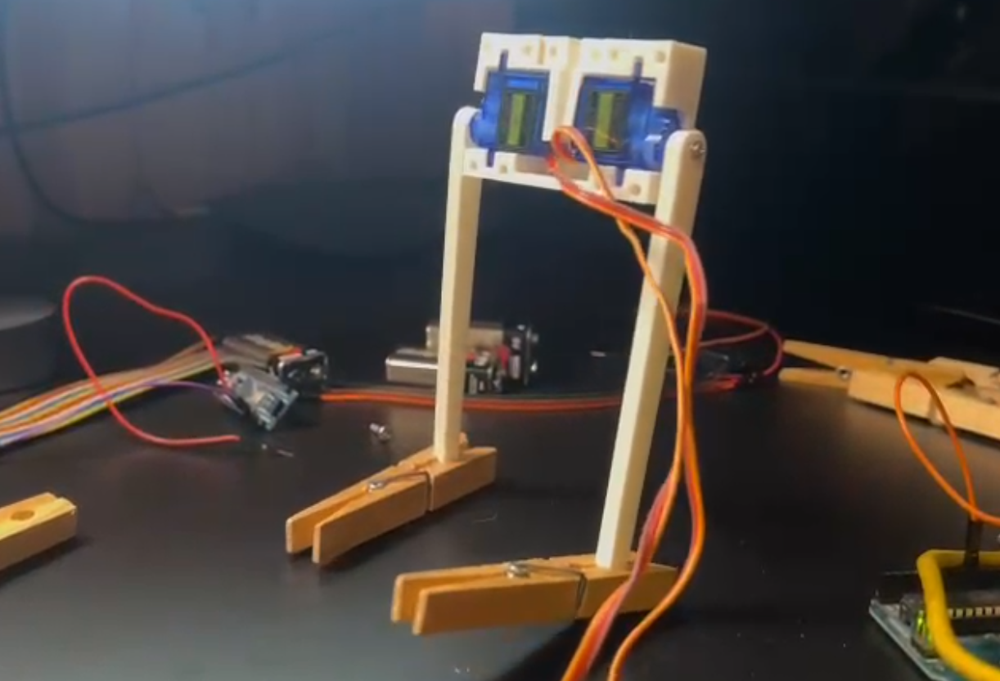
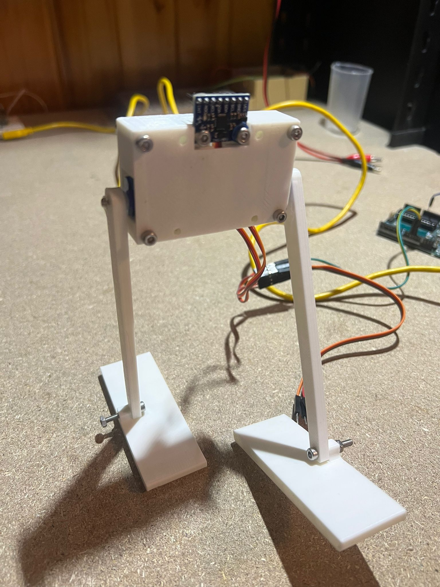

# EntregaHumanoides
## Tabla de Contenidos
1. [Introducción](#Introduccion)
2. [Plano Sagital: lipm2d_sagital.py](#S)
5. [Mejoras: Sagital_Mejorado.py](#MS)
3. [Plano Frontal: lipm2d_frontal.py](#F)
4. [Mejoras: Frontal_Mejorado.py](#MF)
6. [Robot Bipedo: BOBY ](#BOB)

## Introducción 
Tal y como se meciona en el guión con esta practica se pretende estudiar la locomocion bipeda. Dado que mi apellido es "rayado" y contiene 6 letras, la variable HEIGHT sera igual a 1.2m en toda la práctica.  

## Plano Sagital 
No se ha requerido ninguna modificación.
[Video](https://youtu.be/t9dBL4-J16M)

## Plano Sagital Mejorado 

### Características Principales
Se ha mejorado significativamente el código original añadiendo mayor estructura, visualización avanzada, controles interactivos y análisis adicional.
### Mejoras:
#### Estructura del Código
- Organización orientada a objetos: Separación clara entre modelo físico, simulación y visualización
- Documentación completa: Docstrings explicativos y comentarios detallados
- Mejor manejo de estados: Control del ciclo de vida de la simulación
#### Visualizacion 
- Panel informativo en tiempo real: Muestra datos de posición, velocidad y estado
- Visualización de ZMP: Puntos y transiciones claramente marcados
- Gráfico de energía: Nuevo gráfico que muestra la evolución energética del sistema
- Mejor estética: Leyendas y cuadrículas mejoradas
### Funcionalidad
- Botones para pausar/reanudar/parar
- Calculo de energía 

## Plano Frontal 
Se ha realizado la modificacion de los siguientes parámetros:
<pre> self.zmp_y = [0.4, 0.8, 0.4, 0.8, 0.4, 0.8, 0.4] </code></pre>
<pre> self.zmp_time_change = [0.4, 1, 1.8, 8, 10.0] </code></pre>

Con estas modificaciones se consigue que sea capaz de hacer ida-vuelta-ida
[Video](https://youtu.be/FZKNNdqZmL8)

## Plano Frontal Mejorado 

### Mejoras realizadas:
<ol class="marker:text-textOff list-decimal">
<li>

<strong>Vista principal mejorada</strong>: Visualización completa del péndulo con línea de conexión y masa, representación de los puntos ZMP (Zero Moment Point), trazado de la trayectoria del Centro de Masa (CoM) y visualización de los pies (izquierdo/derecho) usando rectángulos de colores diferenciados.

</li>
<li>

<strong>Panel de información en tiempo real</strong>: Muestra el tiempo actual, posición, velocidad, aceleración, ZMP actual, pie activo y energía orbital.

</li>
<li>

<strong>Múltiples gráficas de análisis</strong>: Incluye gráfica de posición vs. tiempo (del CoM y del ZMP), gráfica de velocidad vs. tiempo, retrato de fase (relación entre posición y velocidad) y evolución de la energía orbital a lo largo del tiempo.

</li>
<li>

<strong>Cálculos dinámicos</strong>: Se calcula la posición usando las ecuaciones del LIPM: y = y₀·cosh(t/Tc) + Tc·ẏ₀·sinh(t/Tc), la velocidad: ẏ = (y₀·sinh(t/Tc)/Tc) + ẏ₀·cosh(t/Tc), y la aceleración: ÿ = (y₀/(Tc²))·cosh(t/Tc) + (ẏ₀/Tc)·sinh(t/Tc).

</li>
<li>

<strong>Energía orbital</strong>: Calculada como E = (1/2)·ẏ² - (g/2h)·y², se representa su evolución temporal y se conserva durante cada fase de apoyo.

</li>
<li>

<strong>Transiciones de apoyo</strong>: Se calcula el punto de cambio de ZMP, se conserva la velocidad durante la transición y se ajusta la posición relativa al nuevo punto de apoyo.

</li>
</ol>

## Robot Bipedo: BOBY 

Para estudiar más en profundidad la locomoción bípeda, he desarrollado un robot al que he llamado Boby. Boby es más bien medio robot, ya que solo consta de dos piernas movidas por un total de dos servomotores 9G, uno por pierna. El diseño de Boby no supuso un gran desafío en términos generales, ya que se basó en conceptos básicos de robots bípedos simplificados, enfocados en replicar el movimiento esencial de caminar con la menor cantidad de componentes posible. Sin embargo, un componente clave presentó una dificultad significativa: los pies. Con solo un servomotor por pierna, el control del equilibrio y la estabilidad se vuelve extremadamente complicado, y los pies juegan un papel crucial para compensar esta limitación. El diseño de los pies necesitaba garantizar un contacto adecuado con el suelo y una base lo suficientemente amplia para soportar el peso del robot, algo que todavia no esta optimizado.

Ficheros 3D y código en la carpeta Boby
### Boby anda!!! [Video](https://youtu.be/WE5tCC_DQgw)

### Boby con sus primeros pies

### Boby version final

### Codigo Boby

<h2 class="mb-2 mt-6 text-lg font-[500] first:mt-0 dark:font-[475]" id="explicacin-general">Explicación General</h2>

El código mueve dos servomotores (pierna izquierda y derecha) de manera coordinada, usando funciones seno para simular un movimiento suave y alternado, como si el robot caminara.

<h2 class="mb-2 mt-6 text-lg font-[500] first:mt-0 dark:font-[475]" id="secciones-del-cdigo">Secciones del Código</h2>
<h2 class="mb-xs mt-5 text-base font-[500] first:mt-0 dark:font-[475]">1. <strong>Inclusión de la librería y creación de objetos Servo</strong></h2>

<pre class="not-prose w-full rounded font-mono text-sm font-extralight">

<button type="button" class="focus-visible:bg-offsetPlus dark:focus-visible:bg-offsetPlusDark hover:bg-offsetPlus text-textOff dark:text-textOffDark hover:text-textMain dark:hover:bg-offsetPlusDark  dark:hover:text-textMainDark font-sans focus:outline-none outline-none outline-transparent transition duration-300 ease-out font-sans  select-none items-center relative group/button  justify-center text-center items-center rounded-full cursor-pointer active:scale-[0.97] active:duration-150 active:ease-outExpo origin-center whitespace-nowrap inline-flex text-sm h-8 aspect-square">

<svg aria-hidden="true" focusable="false" data-prefix="far" data-icon="copy" class="svg-inline--fa fa-copy fa-fw fa-1x " role="img" xmlns="http://www.w3.org/2000/svg" viewBox="0 0 448 512"><path fill="currentColor" d="M384 336l-192 0c-8.8 0-16-7.2-16-16l0-256c0-8.8 7.2-16 16-16l140.1 0L400 115.9 400 320c0 8.8-7.2 16-16 16zM192 384l192 0c35.3 0 64-28.7 64-64l0-204.1c0-12.7-5.1-24.9-14.1-33.9L366.1 14.1c-9-9-21.2-14.1-33.9-14.1L192 0c-35.3 0-64 28.7-64 64l0 256c0 35.3 28.7 64 64 64zM64 128c-35.3 0-64 28.7-64 64L0 448c0 35.3 28.7 64 64 64l192 0c35.3 0 64-28.7 64-64l0-32-48 0 0 32c0 8.8-7.2 16-16 16L64 464c-8.8 0-16-7.2-16-16l0-256c0-8.8 7.2-16 16-16l32 0 0-48-32 0z"></path></svg>

</button>

cpp

<code style="white-space: pre-wrap; font-size: inherit; font-family: inherit; line-height: 1.66667; padding: 8px;">#include &lt;Servo.h&gt;

Servo piernaIzquierda;
Servo piernaDerecha;
</code>

</pre>

<ul class="marker:text-textOff list-disc">
<li>

<strong>Incluye</strong> la librería necesaria para controlar servos.

</li>
<li>

<strong>Crea dos objetos</strong> para controlar cada pierna.

</li>
</ul>

<h2 class="mb-xs mt-5 text-base font-[500] first:mt-0 dark:font-[475]">2. <strong>Definición de constantes y variables</strong></h2>

<pre class="not-prose w-full rounded font-mono text-sm font-extralight">

<button type="button" class="focus-visible:bg-offsetPlus dark:focus-visible:bg-offsetPlusDark hover:bg-offsetPlus text-textOff dark:text-textOffDark hover:text-textMain dark:hover:bg-offsetPlusDark  dark:hover:text-textMainDark font-sans focus:outline-none outline-none outline-transparent transition duration-300 ease-out font-sans  select-none items-center relative group/button  justify-center text-center items-center rounded-full cursor-pointer active:scale-[0.97] active:duration-150 active:ease-outExpo origin-center whitespace-nowrap inline-flex text-sm h-8 aspect-square">

<svg aria-hidden="true" focusable="false" data-prefix="far" data-icon="copy" class="svg-inline--fa fa-copy fa-fw fa-1x " role="img" xmlns="http://www.w3.org/2000/svg" viewBox="0 0 448 512"><path fill="currentColor" d="M384 336l-192 0c-8.8 0-16-7.2-16-16l0-256c0-8.8 7.2-16 16-16l140.1 0L400 115.9 400 320c0 8.8-7.2 16-16 16zM192 384l192 0c35.3 0 64-28.7 64-64l0-204.1c0-12.7-5.1-24.9-14.1-33.9L366.1 14.1c-9-9-21.2-14.1-33.9-14.1L192 0c-35.3 0-64 28.7-64 64l0 256c0 35.3 28.7 64 64 64zM64 128c-35.3 0-64 28.7-64 64L0 448c0 35.3 28.7 64 64 64l192 0c35.3 0 64-28.7 64-64l0-32-48 0 0 32c0 8.8-7.2 16-16 16L64 464c-8.8 0-16-7.2-16-16l0-256c0-8.8 7.2-16 16-16l32 0 0-48-32 0z"></path></svg>

</button>

cpp

<code style="white-space: pre-wrap; font-size: inherit; font-family: inherit; line-height: 1.66667; padding: 8px;">const int CENTRO_IZQ = 95;
const int CENTRO_DER = 95;
const int AMPLITUD = 15;
int DURACION_PASO = 1000;
int pasos = 100;
</code>

</pre>

<ul class="marker:text-textOff list-disc">
<li>

<code>CENTRO_IZQ</code> y <code>CENTRO_DER</code>: Ángulos centrales de reposo de cada pierna.

</li>
<li>

<code>AMPLITUD</code>: Cuánto se moverán los servos desde el centro (más amplitud = paso más largo).

</li>
<li>

<code>DURACION_PASO</code>: Tiempo total de un ciclo de paso (ida y vuelta).

</li>
<li>

<code>pasos</code>: Cantidad de pasos intermedios para suavizar el movimiento.

</li>
</ul>

<h2 class="mb-xs mt-5 text-base font-[500] first:mt-0 dark:font-[475]">3. <strong>Configuración inicial (<code>setup</code>)</strong></h2>

<pre class="not-prose w-full rounded font-mono text-sm font-extralight">

<button type="button" class="focus-visible:bg-offsetPlus dark:focus-visible:bg-offsetPlusDark hover:bg-offsetPlus text-textOff dark:text-textOffDark hover:text-textMain dark:hover:bg-offsetPlusDark  dark:hover:text-textMainDark font-sans focus:outline-none outline-none outline-transparent transition duration-300 ease-out font-sans  select-none items-center relative group/button  justify-center text-center items-center rounded-full cursor-pointer active:scale-[0.97] active:duration-150 active:ease-outExpo origin-center whitespace-nowrap inline-flex text-sm h-8 aspect-square">

<svg aria-hidden="true" focusable="false" data-prefix="far" data-icon="copy" class="svg-inline--fa fa-copy fa-fw fa-1x " role="img" xmlns="http://www.w3.org/2000/svg" viewBox="0 0 448 512"><path fill="currentColor" d="M384 336l-192 0c-8.8 0-16-7.2-16-16l0-256c0-8.8 7.2-16 16-16l140.1 0L400 115.9 400 320c0 8.8-7.2 16-16 16zM192 384l192 0c35.3 0 64-28.7 64-64l0-204.1c0-12.7-5.1-24.9-14.1-33.9L366.1 14.1c-9-9-21.2-14.1-33.9-14.1L192 0c-35.3 0-64 28.7-64 64l0 256c0 35.3 28.7 64 64 64zM64 128c-35.3 0-64 28.7-64 64L0 448c0 35.3 28.7 64 64 64l192 0c35.3 0 64-28.7 64-64l0-32-48 0 0 32c0 8.8-7.2 16-16 16L64 464c-8.8 0-16-7.2-16-16l0-256c0-8.8 7.2-16 16-16l32 0 0-48-32 0z"></path></svg>

</button>

cpp

<code style="white-space: pre-wrap; font-size: inherit; font-family: inherit; line-height: 1.66667; padding: 8px;">void setup() {
  piernaIzquierda.attach(10);
  piernaDerecha.attach(11);
  piernaIzquierda.write(CENTRO_IZQ);
  piernaDerecha.write(CENTRO_DER);
  delay(1000);
}
</code>

</pre>

<ul class="marker:text-textOff list-disc">
<li>

<strong>Conecta</strong> los servos a los pines 10 y 11.

</li>
<li>

<strong>Coloca</strong> ambos servos en la posición central.

</li>
<li>

<strong>Espera</strong> 1 segundo antes de comenzar.

</li>
</ul>

<h2 class="mb-xs mt-5 text-base font-[500] first:mt-0 dark:font-[475]">4. <strong>Bucle principal (<code>loop</code>)</strong></h2>

<pre class="not-prose w-full rounded font-mono text-sm font-extralight">

<button type="button" class="focus-visible:bg-offsetPlus dark:focus-visible:bg-offsetPlusDark hover:bg-offsetPlus text-textOff dark:text-textOffDark hover:text-textMain dark:hover:bg-offsetPlusDark  dark:hover:text-textMainDark font-sans focus:outline-none outline-none outline-transparent transition duration-300 ease-out font-sans  select-none items-center relative group/button  justify-center text-center items-center rounded-full cursor-pointer active:scale-[0.97] active:duration-150 active:ease-outExpo origin-center whitespace-nowrap inline-flex text-sm h-8 aspect-square">

<svg aria-hidden="true" focusable="false" data-prefix="far" data-icon="copy" class="svg-inline--fa fa-copy fa-fw fa-1x " role="img" xmlns="http://www.w3.org/2000/svg" viewBox="0 0 448 512"><path fill="currentColor" d="M384 336l-192 0c-8.8 0-16-7.2-16-16l0-256c0-8.8 7.2-16 16-16l140.1 0L400 115.9 400 320c0 8.8-7.2 16-16 16zM192 384l192 0c35.3 0 64-28.7 64-64l0-204.1c0-12.7-5.1-24.9-14.1-33.9L366.1 14.1c-9-9-21.2-14.1-33.9-14.1L192 0c-35.3 0-64 28.7-64 64l0 256c0 35.3 28.7 64 64 64zM64 128c-35.3 0-64 28.7-64 64L0 448c0 35.3 28.7 64 64 64l192 0c35.3 0 64-28.7 64-64l0-32-48 0 0 32c0 8.8-7.2 16-16 16L64 464c-8.8 0-16-7.2-16-16l0-256c0-8.8 7.2-16 16-16l32 0 0-48-32 0z"></path></svg>

</button>

cpp

<code style="white-space: pre-wrap; font-size: inherit; font-family: inherit; line-height: 1.66667; padding: 8px;">void loop() {
  for (int i = 0; i &lt;= pasos; i++) {
    float fase = 2 * PI * i / pasos;  // Avanza en un ciclo seno
    float movIzq = sin(fase);         // -1 a +1
    float movDer = sin(fase + PI);    // Desfase de 180°, pierna opuesta

    int anguloIzq = constrain(CENTRO_IZQ + AMPLITUD * movIzq, 0, 180);
    int anguloDer = constrain(CENTRO_DER - AMPLITUD * movDer, 0, 180);

    piernaIzquierda.write(anguloIzq);
    piernaDerecha.write(anguloDer);

    delay(DURACION_PASO / pasos);
  }
}
</code>

</pre>

<h2 class="mb-xs mt-5 text-base font-[500] first:mt-0 dark:font-[475]">¿Qué hace este bucle?</h2>
<ul class="marker:text-textOff list-disc">
<li>

<strong>Recorre</strong> desde 0 hasta <code>pasos</code> (100), dividiendo el ciclo en pequeños movimientos suaves.

</li>
<li>

<strong>Calcula la fase</strong> para cada paso usando la función seno, que genera un movimiento suave de ida y vuelta.

</li>
<li>

<strong><code>movIzq</code></strong>: Movimiento de la pierna izquierda (oscila entre -1 y 1).

</li>
<li>

<strong><code>movDer</code></strong>: Movimiento de la pierna derecha, pero desplazado 180° (desfasado, para que cuando una pierna va adelante la otra va atrás).

</li>
<li>

<strong>Calcula los ángulos</strong> para cada servo sumando o restando la amplitud al centro, y los limita entre 0 y 180 grados.

</li>
<li>

<strong>Mueve los servos</strong> a los ángulos calculados.

</li>
<li>

<strong>Espera</strong> un pequeño intervalo antes de pasar al siguiente paso, para que el movimiento sea fluido.

</li>
</ul>

<h2 class="mb-2 mt-6 text-lg font-[500] first:mt-0 dark:font-[475]" id=""><strong>Resumen Visual</strong></h2>
<ul class="marker:text-textOff list-disc">
<li>

<strong>Ambas piernas</strong> se mueven alternadamente, simulando el caminar.

</li>
<li>

<strong>El movimiento es suave</strong> gracias al uso de la función seno.

</li>
<li>

<strong>Puedes ajustar</strong> la velocidad (<code>DURACION_PASO</code>), la amplitud del paso (<code>AMPLITUD</code>), y la suavidad (<code>pasos</code>).

</li>
</ul>

